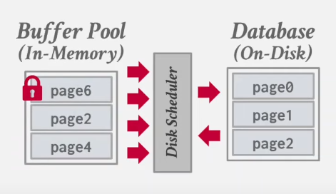

# Buffer Pool Manager

The buffer pool manager is responsible for moving pages back on forth between the memory and disk, as they are needed (requested by other parts of the system, via the pages' *page identifier*). This component is **thread-safe**, as it will be accessed by multiple workers in the system.

It's made up of these three main components:
- LRU-K Replacement Policy
- Disk Scheduler
- Buffer Pool Manager

**Note:** The *Buffer Pool Manager* is built on top of (internally uses in its implementation) the other two components: the *LRU-K Replacement Policy* and the *Disk Scheduler*.

## LRU-K Replacement Policy

This component is responsible of tracking page usage in the buffer poola manager. It uses the [LRU-K](https://www.cs.cmu.edu/~natassa/courses/15-721/papers/p297-o_neil.pdf) algorithm to evict frames from the buffer pool manager.

### Characteristics

There are two properties that describe a LRU-K replacement policy:
1. `num_frames`: the maximum number of frames that the replacer will be required to store
2. `k`: How many historical access timestamps get recorded for each frame

### Interface

The interface (i.e. the functionalities that it implements) exposed by the replacement policy looks like this:
- `evict() -> Optional<frame_id>`: Finds the frame with the largest k-distance and evicts that frame. The return value contains the id of the frame that was evicted (or nothing if no frames can be evicted).
- `record_access(frame_id, access_type)`: Records that the given `frame_id` has been accessed at the current timestamp with the `access_type` type of access. Can throw exception if the `frame_id` is invalid.
- `set_evictable(frame_id, set_evictable)`: Set if the frame with `frame_id` is evictable to the value of `set_evictable` (true/false), which controls the the replacer's size. Can throw exception if the `frame_id` is invalid.
- `remove(frame_id)`: Remove and evictable frame with `frame_id` from the replacer, along with its access history, which will decrement the size if removal was successful. Can throw exception if the frame is not evictable. If the frame was not found in replacer, just returns.
- `size() -> usize`: Returns the size of the replacer (which is the number of evictable frames inside it).

## Disk Scheduler

This component can be used by other components in the system to queue disk requests. The disk scheduler will maintain a background worker thread that will be responsible for processing scheduled requests.

### Interface

The interface exposed by the disk scheduler looks like this:
- `schedule(r: DiskRequest)`: Schedules a request for the disk scheduler to execute
- `start_worker_thread()`: Starts the background worker thread that takes and executes the scheduled requests.

### Constraints

The implementation needs to be thread safe, as the disk scheduler is shared between multuple threads.

**Note:** The disk sheduler uses a **disk manager** that can read and write pages to the disk.

## Buffer Pool Manager

This component is responsible of moving physical pages back and forth between memory (buffers) and disk. It also behaves as a cache, keeping frequently accessed pages in memory for faster access, and evicting unused/cold pages back out to storage.

This component uses both the *LRU-K Replacement Policy* and the *Disk Scheduler* to achieve its purpose.

## Characteristics

The properties that describe a buffer pool manager are:
- `frames`: The number of frames it has
- `k_dist`: The k-distance used for the replacement policy

## Interface

The interface exposed by this component looks like this:
- `fetch_page(page_id)`: This fetch can be of two types: *read* and *write* (depending on what the page is going to be used for) - check constraints section for more details.
- `flush_page(page_id) -> bool`: Flush a page's data out to disk. Will return `false` if the given page is not in memory.
- `new_page() -> page_id`: Allocate a new page on disk. Keeps track of the page id (simple implementation is to constantly increase it via a counter) and will also increase the disk size of the database file in case the current id is greater than the allocated disk size.
- `delete_page(page_id) -> bool`: Removes page from database (both disk and memory). Returns `false` if the page is pinned.
- `flush_all_pages()`: Flushes all the pages in memory to disk.

## Constraints

This implementation needs to be thread-safe, as it will be used across multiple worker threads.

For each of the pages that are being stored in the buffer, only a single thread should be able to have **write access** to it at one time, but multiple threads can have access to it if they only need **read access** to the page. The logic should be similar to the logic of the borrowing rules of Rust, or or a [shared_mutex](https://en.cppreference.com/w/cpp/thread/shared_mutex) in C++.

**Note:** Here is some book about concurrency in Rust that seems pretty good for establishing foundamentals: [https://marabos.nl/atomics/](https://marabos.nl/atomics/)
