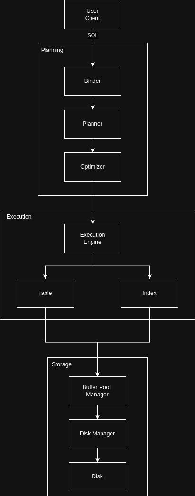

# Plan

This note is meant to document the progress that has been made in developing this project. Here are the planned components/entities of the system:
- [x] Disk Manager (is capable of reading/writing pages to disk via a request interface)
- [x] Buffer Pool (caches pages on disk in memory)
- [x] Extendible Hash Table (hash table implementation that can be used for indexes)
- [x] Table (representation of a table)
- [ ] User Client (similar to `psql` - takes user commands and feeds to database engine)
- [x] Parser (takes in a SQL string and spits out an AST)
- [ ] Planner (takes the binder's output and creates a plan tree)
- [ ] Optimizer (takes a plan tree and spits out an optimized plan tree)
- [ ] (WIP - blocked) Execution Engine (takes in a plan tree and executes it)
- [ ] (WIP) Catalog (database of database's metadata) - this will require to also implement the `Index`
- [x] Index (using the extendible hash table data structure)

## System Overview

